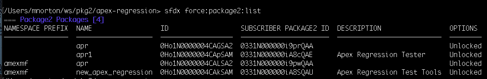
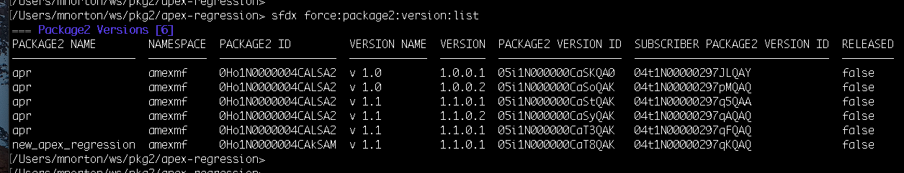
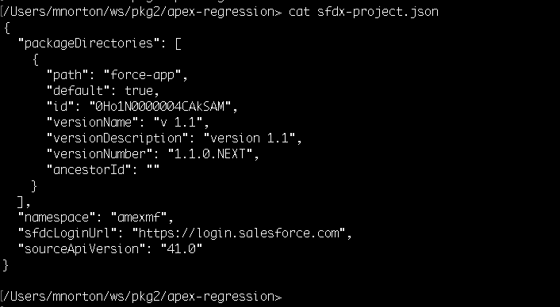

# Usage: sfdx force:package2:COMMAND [command-specific-options]

### Package 2 Commands
#### sfdx force:package2 --help

```
develop second-generation packages

sfdx force:package2 commands: (get help with sfdx help force:package2:COMMAND)
 force:package2:create               create a second-generation package
 force:package2:list                 list all second-generation packages in the
                                     Dev Hub org
 force:package2:update               update a second-generation package
 force:package2:version:create       create a second-generation package version
 force:package2:version:create:get   retrieve a package version creation request
 force:package2:version:create:list  list package version creation requests
 force:package2:version:get          retrieve a package version in the Dev Hub
                                     org
 force:package2:version:list         list all package versions in the Dev Hub
                                     org
 force:package2:version:update       update a second-generation package version
```

Some sample output from **package2** commands

```sfdx force:package2:list```



```sfdx force:package2:version:list```



```cat sfdx-project.json```



